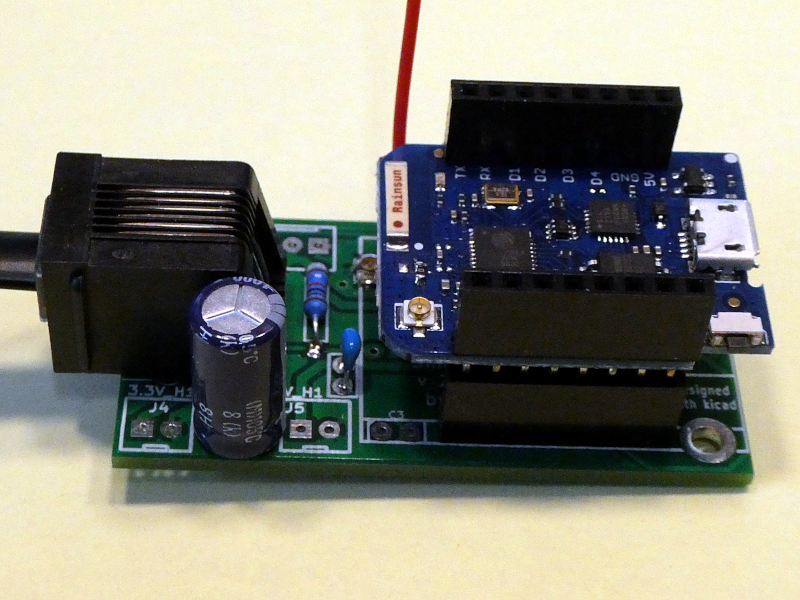

# SmartyReader: Reading encrypted Luxembourgish smartmeter data

## All infos on: <http://weigu.lu/microcontroller/smartyReader/index.html>

## Some infos

Because of the EU Energy Efficiency Directive from 2012 the gas and electricity Distribution System Operators (DSO) in Luxembourg replaced there gas and energy meters with smartmeters (named smarty :() from Sagemcom (T210-D).

As it seems the same smartmeters are deployed in Sweden, parts of Austria and the Netherlands.

These smartmeters have a user port that delivers 10 second data (RJ12 connector under the green lid). The P1 data output communication protocol and format is specified in the  [Dutch Smart Meter Requirements v5.0.2 ](https://smarty.creos.net/wp-content/uploads/DutchSmartMeterRequirements.pdf). The solution deployed in Luxembourg includes an additional security layer standard that is conform to the IDIS package 2.0 requirement. The encryption layer is based on DLMS security suite 0 algorithm: AES128-GCM. More information can be found in this [document](https://smarty.creos.net/wp-content/uploads/P1PortSpecification.pdf).

The Smartyreader is a simple board designed with KiCAD and decrypting the smartmeter data with an ESP8266 (Lolin D1 mini pro). The data is then published over MQTT via WiFi or Ethernet. A new version allows also to use LoRa or LoRaWAN.

For infos from the newest software look here: <https://github.com/weigu1/SmartyReader/tree/main/Arduino/SmartyReader_P1_WiFi_Ethernet>.

